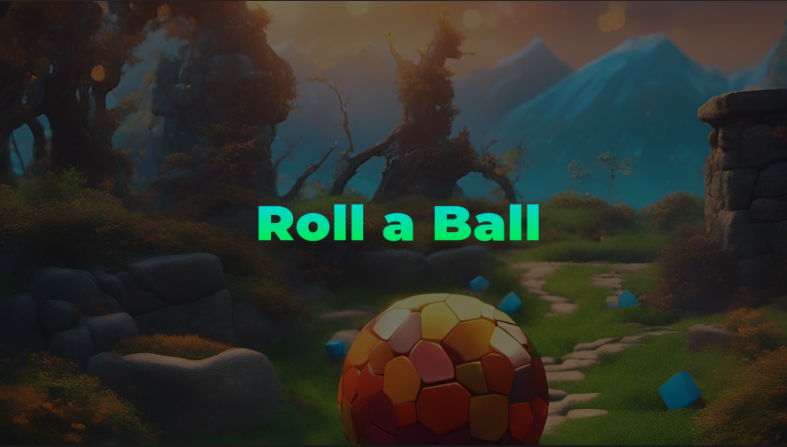

# Roll a ball

Link itch.io: https://giancarlovr.itch.io/roll-a-ball 

O  objetivo do jogo é coletar o máximo de cubos amarelos até o final do percurso antes que o tempo acabe, sendo 2 minutos e 40 segundos. Caso colete o cubo vermelho o decréscimo da pontuação será da seguinte forma:

- Caso a pontuação do jogador seja menor que 5:

  - Irá diminuir em 1 ponto

- Caso a pontuação seja menor que 10 e maior ou igual que 5:

  - Irá diminuir em 2 pontos

- Caso a pontuação seja maior que ou igual a 10:

  - Irá diminuir os pontos pela metade

Caso a pontuação fique negativa o jogador perde o jogo

Para mover a esfera basta utilizar as setas direcionais ou as teclas WSAD

## Assets
- [Grass And Flowers Pack 1](https://assetstore.unity.com/packages/2d/textures-materials/nature/grass-and-flowers-pack-1-17100?aid=1011ld79j&utm_campaign=unity_affiliate&utm_medium=affiliate&utm_source=partnerize-linkmaker)
- [Outdoor Ground Textures](https://assetstore.unity.com/packages/2d/textures-materials/floors/outdoor-ground-textures-12555?aid=1011ld79j&utm_campaign=unity_affiliate&utm_medium=affiliate&utm_source=partnerize-linkmaker#content)
- [Pixabay](https://pixabay.com/pt/sound-effects/search/game/)
- [Night Cafe](https://creator.nightcafe.studio/)

## Referências
- [How to make Terrain in Unity!](https://www.youtube.com/watch?v=MWQv2Bagwgk&t=107s)
- [Camera-Relative Movement in Unity 3D Explained](https://www.youtube.com/watch?v=7kGCrq1cJew)
- [How to Make Beautiful Terrain in Unity 2020 | Beginner Tutorial](https://www.youtube.com/watch?v=ddy12WHqt-M)
- [How to Create a Simple Countdown Timer in Unity](https://www.youtube.com/watch?v=hxpUk0qiRGs)
- [Aprenda como criar um MENU PRINCIPAL na Unity de forma Simples e Elegante](https://www.youtube.com/watch?v=yIaAE9bLxXI)
- [AudioSource na Unity | Colocando uma Música de Fundo no nosso Menu Principal](https://www.youtube.com/watch?v=orMnMpWx3Ns&t=48s)
